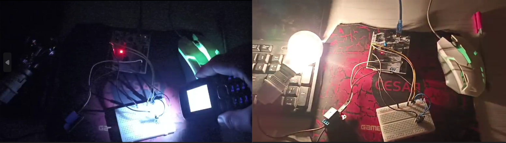

# 💡 LDR-Based-Automatic-Darkness-Detection-Circuit-Simple-DIY
An automatic light-control system that uses a darkness-activated sensor built with an LDR and a microcontroller. When the ambient light level drops below a set threshold, the circuit turns on a lamp through a relay, and automatically switches it off again when the environment becomes bright.
## 📄 Description
This project implements an automatic darkness-detection system using an LDR and an STM32 microcontroller. The firmware is written using STM32CubeIDE **without using HAL or STM32CubeMX graphical configuration**. The digital LDR sensor provides a HIGH or LOW signal depending on the ambient light intensity. This signal is read through a GPIO input pin, allowing the MCU to detect light or darkness conditions. When the light intensity falls below a defined threshold, the microcontroller activates a relay to turn ON a lamp; when brightness increases, it turns the lamp OFF. This setup demonstrates basic automation, and low-level embedded development on STM32. 
## ⚙️ Tools and Technologies

#### 1. Hardware components
- **Microcontroller**: STM32 Nucleo-L476RG
- **Sensor**: Digital LDR Light Sensor Module
- **Display**: I²C LCD 16x2
- **Programming**:
  - IDE: STM32CubeIDE
  - Abstraction Level: **Bare-Metal (Raw Registers)** and **CMSIS Register Access (No HAL)**
- **Demo**: Simple demonstration video showcasing how the system automatically turns the lamp ON in darkness and OFF when light is detected.

  
  
   [▶️ Download Demo](Demo.mp4)

#### 1.2 Hardware connections
- **Relay Module** : 
  - VCC → 5V
  - IN → PA7 (Pin configured as GPIO_Output)
  - GND → GND
- **LDR** : 
  - LDR D0 → PA0 (Pin configured as GPIO_Input)
  - One leg of the LDR → 5V
  - The other leg of the LDR → GND

---
## ⚙️ Implementation Approaches
This project demonstrates two low-level approaches for interfacing a digital infrared (IR) sensor with the STM32F103C8T6 (Bluepill), without using HAL or STM32CubeMX graphical configuration.
Both versions provide direct hardware control but differ in abstraction level and portability.

#### 1. Version 1 : Raw Register Access
##### Description
This version uses direct memory access with manually defined register addresses. Hardware registers are accessed using fixed memory addresses from the reference manual.
This approach represents the lowest-level interaction with the microcontroller.

##### Implementation Method
Registers are defined using macros pointing to their absolute addresses.   
Example usage :  
#define RCC_APB2ENR   (*(volatile uint32_t*)0x40021018)  
RCC_APB2ENR |= (1<<2);     // Enable GPIOA clock
##### Characteristics
- Direct access to hardware memory
- No external libraries required
- Uses reference manual addresses
- Maximum hardware transparency
- ##### Advantages
- Maximum control over hardware
- Best for learning microcontroller internals
- 
#### 2. Version 2 : CMSIS Register Access (Structured Register Mapping)
##### Description
This version uses the CMSIS (Cortex Microcontroller Software Interface Standard) device header provided by ST.
Registers are accessed using structured register definitions instead of raw addresses.
CMSIS maps peripherals into C structures, making the code safer and easier to read.

##### Implementation Method
CMSIS defines peripherals as structures.  
Example usage :  
RCC->APB2ENR |= RCC_APB2ENR_IOPAEN;
##### Characteristics
- Uses CMSIS device header
- No HAL or LL drivers
- Direct register control via structured access
- Provided by STM32CubeIDE automatically
- ##### Advantages
- Much more readable
- Safer than raw address access
- Portable across STM32 devices

---
This project demonstrates the evolution of embedded software abstraction:
Raw addresses → CMSIS → HAL → RTOS
Understanding CMSIS is essential because it provides low-level control while maintaining clean and portable code.

---
## 📖 Guide to Use
1. Clone this repository:
git clone https://github.com/Ghouilaanas/LDR-Based-Automatic-Darkness-Detection-Circuit-Simple-DIY.git
2. 📂 **Open the STM32CubeIDE project** corresponding to the desired implementation approach included in the repository to view the low-level (LL) ADC/relay control code.
3. 🛠️ **Build and flash the firmware** to your STM32 board using STM32CubeIDE.
4. 🔌 **Assemble the hardware setup** by connecting the LDR light sensor module, relay module, and lamp to the STM32 according to the wiring diagram.
5. ⚡ **Power on the system** and **observe** how the system automatically turns the lamp ON in darkness and OFF when light is detected.
